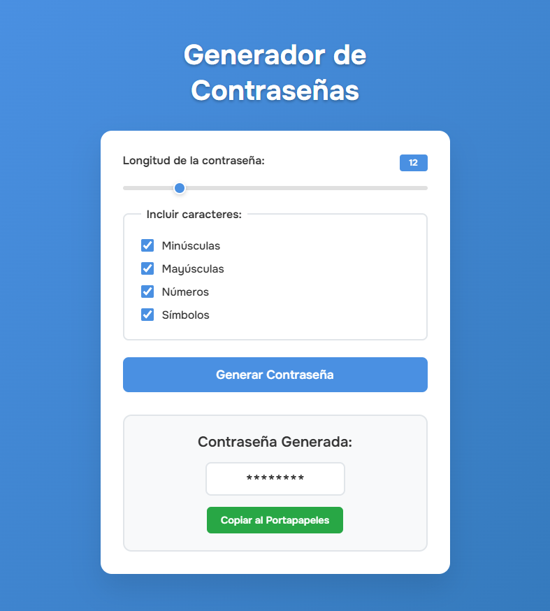

# 🔐 Generador de Contraseñas

Un generador de contraseñas seguras y personalizables desarrollado con HTML, CSS y JavaScript vanilla. Este es el **Proyecto #6** de mi serie de proyectos de desarrollo web.

## 📋 Descripción

Aplicación web que genera contraseñas seguras y aleatorias con opciones de personalización completas. Permite configurar la longitud, tipos de caracteres a incluir y copiar la contraseña generada al portapapeles con un solo clic.

## ✨ Características Implementadas

- **Longitud personalizable:** Slider de 4 a 50 caracteres
- **Tipos de caracteres configurables:** Minúsculas, mayúsculas, números y símbolos
- **Generación aleatoria:** Algoritmo seguro para contraseñas únicas
- **Validación inteligente:** Previene deseleccionar todos los tipos de caracteres
- **Copia al portapapeles:** Función de copia con feedback visual
- **Interfaz intuitiva:** Controles claros y accesibles
- **Diseño responsivo:** Adaptado para móviles y desktop
- **Efectos visuales modernos:** Animaciones y transiciones suaves
- **Feedback temporal:** Confirmación visual al copiar
- **Tipografía monospace:** Visualización clara de contraseñas

## 🛠️ Tecnologías Utilizadas

- **HTML5:** Estructura semántica moderna con:
  - Formularios accesibles con fieldset/legend
  - Input range para longitud
  - Checkboxes para opciones
  - Meta tags optimizados
- **CSS3:** Estilos avanzados con:
  - Gradientes lineales para fondos
  - Flexbox para layouts centrados
  - Custom styling para inputs
  - Transiciones y animaciones
  - Media queries responsivas
  - Box-shadow y backdrop-filter
- **JavaScript ES6+:** Lógica avanzada con:
  - Event listeners múltiples
  - Clipboard API nativa
  - Array methods (forEach, some)
  - Math.random para generación
  - Módulos de funciones puras
  - Error handling con try-catch
- **Google Fonts:** Tipografía Onest (100-900 weights)

## 🎨 Diseño y Estilo

### Paleta de Colores

```css
/* Tema moderno y confiable */
--bg-primary: linear-gradient(
  135deg,
  #4a90e2 0%,
  #357abd 100%
); /* Fondo gradiente */
--bg-container: #ffffff; /* Fondo del contenedor */
--bg-result: #f8f9fa; /* Fondo del resultado */
--text-primary: #333333; /* Texto principal */
--text-white: #ffffff; /* Texto blanco */
--accent: #4a90e2; /* Color de acento azul */
--accent-hover: #2e6ba8; /* Acento en hover */
--success: #28a745; /* Verde para copiar */
--success-hover: #218838; /* Verde hover */
--copied: #17a2b8; /* Azul para copiado */
--border: #e1e5e9; /* Bordes */
```

### Efectos Especiales

- **Gradiente de fondo** diagonal azul
- **Sombras elevadas** con blur y transparencia
- **Animación slideIn** al cargar
- **Transform effects** en hover y active
- **Custom slider styling** para el input range
- **Backdrop-filter blur** para modernidad

## 📱 Diseño Responsivo

### Características

- **Contenedor máximo:** 500px con centrado automático
- **Padding adaptativo:** 20px en desktop, 10px en móvil
- **Tipografía escalable:** Ajustes de tamaño en móviles
- **Botones táctiles:** Tamaños optimizados para touch

### Breakpoints

- **Mobile (max-width: 576px):**
  - Título de 2.5rem a 2rem
  - Padding reducido en contenedores
  - Password display más compacto

## 📂 Estructura del Proyecto

```
06-password-generator/
├── index.html              # Página principal
├── styles.css              # Estilos CSS
├── script.js               # Lógica JavaScript
├── screenshots/            # Capturas de pantalla
│   └── app-view.png        # Vista de la aplicación
└── README.md              # Documentación
```

## 🚀 Instalación y Uso

### Clonar el repositorio

```bash
git clone https://github.com/Zero-Fhx/06-password-generator.git
cd 06-password-generator
```

### Ejecutar el proyecto

1. **Método simple:** Abre `index.html` directamente en tu navegador
2. **Con Live Server (recomendado):**
   - Instala Live Server en VS Code
   - Click derecho en `index.html` → "Open with Live Server"
3. **Servidor local:**

   ```bash
   # Con Python 3
   python -m http.server 8000

   # Con Node.js (http-server)
   npx http-server
   ```

## ✅ Requisitos Cumplidos

Este proyecto incluye todas las características esenciales de un generador de contraseñas:

- [x] Generación de contraseñas aleatorias y seguras
- [x] Longitud personalizable (4-50 caracteres)
- [x] Opciones de tipos de caracteres configurables
- [x] Función de copia al portapapeles
- [x] Interfaz intuitiva y moderna
- [x] Validación de entrada de usuario
- [x] Diseño responsivo completo
- [x] Feedback visual en acciones

## 🌐 Demo en Vivo

🔗 **[Ver Demo](https://zero-fhx.github.io/06-password-generator/)** (GitHub Pages)

## 📸 Captura de Pantalla



## 🔧 Características Técnicas Destacadas

### Generación de Contraseñas Segura

```javascript
function generatePassword(length, options) {
  let characterSet = "";

  if (options.includeLowercase) characterSet += lowercaseChars;
  if (options.includeUppercase) characterSet += uppercaseChars;
  if (options.includeNumbers) characterSet += numberChars;
  if (options.includeSymbols) characterSet += symbolChars;

  if (characterSet.length === 0) {
    return "Debe seleccionar al menos un tipo de carácter.";
  }

  let password = "";
  for (let i = 0; i < length; i++) {
    const randomIndex = Math.floor(Math.random() * characterSet.length);
    password += characterSet[randomIndex];
  }
  return password;
}
```

### Validación Inteligente de Checkboxes

```javascript
checkBoxes.forEach((checkbox) => {
  checkbox.addEventListener("change", () => {
    const isAnyChecked = Array.from(checkBoxes).some((cb) => cb.checked);
    if (!isAnyChecked) {
      checkbox.checked = true;
    }
  });
});
```

### Copia al Portapapeles con Feedback

```javascript
copyButton.addEventListener("click", () => {
  const password = passwordDisplay.textContent;
  navigator.clipboard
    .writeText(password)
    .then(() => {
      copyButton.textContent = "Contraseña Copiada!";
      copyButton.classList.add("copied");
      setTimeout(() => {
        copyButton.textContent = "Copiar al Portapapeles";
        copyButton.classList.remove("copied");
      }, 2000);
    })
    .catch((error) => {
      console.error("Error al copiar la contraseña: ", error);
    });
});
```

### Slider Personalizado CSS

```css
#length::-webkit-slider-thumb {
  -webkit-appearance: none;
  width: 18px;
  height: 18px;
  border-radius: 50%;
  background: #4a90e2;
  cursor: pointer;
  border: 2px solid white;
  box-shadow: 0 2px 6px rgba(0, 0, 0, 0.2);
}
```

### Animación de Entrada

```css
@keyframes slideIn {
  from {
    opacity: 0;
    transform: translateY(20px);
  }
  to {
    opacity: 1;
    transform: translateY(0);
  }
}

.container {
  animation: slideIn 0.5s ease-out;
}
```

## 🔒 Seguridad y Caracteres

### Conjuntos de Caracteres

| Tipo           | Caracteres                  | Cantidad |
| -------------- | --------------------------- | -------- |
| **Minúsculas** | a-z                         | 26       |
| **Mayúsculas** | A-Z                         | 26       |
| **Números**    | 0-9                         | 10       |
| **Símbolos**   | !@#$%^&\*()\_+[]{}\|;:,.<>? | 24       |

### Características de Seguridad

- **Aleatoriedad:** Math.random() para selección impredecible
- **Flexibilidad:** Longitud de 4 a 50 caracteres
- **Diversidad:** Hasta 86 caracteres únicos disponibles
- **Validación:** Prevención de configuraciones inválidas

## 🔮 Futuras Mejoras

- [ ] **Evaluador de fortaleza** con medidor visual
- [ ] **Generación pronunciable** para contraseñas fáciles de recordar
- [ ] **Historial de contraseñas** con almacenamiento local
- [ ] **Exportar contraseñas** a archivos seguros
- [ ] **Configuraciones predefinidas** (básica, media, alta seguridad)
- [ ] **Generador de frases de paso** con palabras aleatorias
- [ ] **Exclusión de caracteres** similares (0, O, l, I)
- [ ] **Generación por lotes** múltiples contraseñas
- [ ] **Integración 2FA** para mayor seguridad
- [ ] **Temas personalizables** con modo oscuro

## 📝 Lecciones Aprendidas

### Seguridad Web

- **Generación aleatoria** para contraseñas seguras
- **Validación de entrada** para prevenir errores
- **Clipboard API** para funcionalidad moderna
- **Error handling** robusto con try-catch

### JavaScript Avanzado

- **Event delegation** eficiente con forEach
- **Array methods** como some() para validación
- **Async/await** con Clipboard API
- **State management** con objetos de configuración

### UX/UI Design

- **Feedback inmediato** en todas las acciones
- **Progresive enhancement** con APIs modernas
- **Accesibilidad** con fieldset y legend
- **Visual hierarchy** clara en la interfaz

### CSS Moderno

- **Custom properties** implícitas en colores
- **Advanced selectors** para styling específico
- **Responsive design** mobile-first
- **Animation performance** con transform

## 🤝 Contribuciones

Este es un proyecto personal de aprendizaje, pero si encuentras mejoras o tienes sugerencias:

1. Fork el repositorio
2. Crea una rama para tu feature (`git checkout -b feature/mejora`)
3. Commit tus cambios (`git commit -m 'Añadir mejora'`)
4. Push a la rama (`git push origin feature/mejora`)
5. Abre un Pull Request

## 👨‍💻 Autor

**Erick Obed Flores Ricra**

- 🐙 GitHub: [@Zero-Fhx](https://github.com/Zero-Fhx)
- 💼 LinkedIn: [Erick Obed Flores Ricra](https://www.linkedin.com/in/erick-obed-flores-ricra-14a121280)
- 📧 Email: erickflores170404@gmail.com

---

**🤖 Desarrollo Asistido por IA:** Este proyecto fue desarrollado con la asistencia de inteligencia artificial para la búsqueda de información, resolución de problemas técnicos, optimización de código, consulta de conceptos desconocidos y creación de esta documentación.
